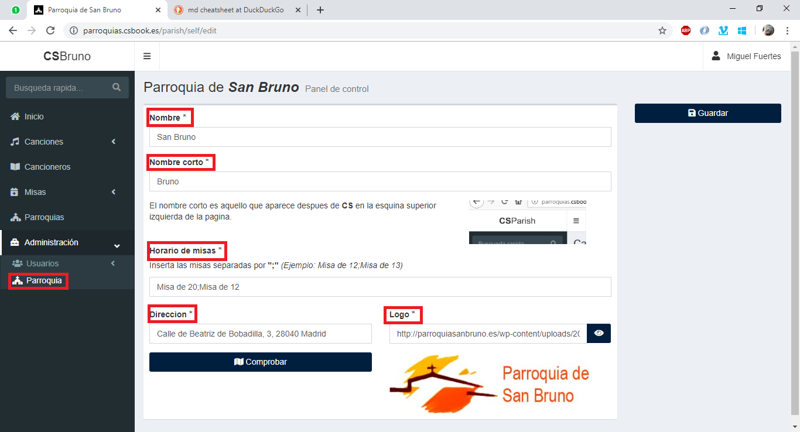

## Administración de Parroquia

> **Nota**: Recuerda que solo un __*Administrador*__ tiene permisos para ver y editar estas paginas.

En la pagina de gestión podremos cambiar ciertos aspectos de la parroquia:
- El nombre
- El nombre corto (lo que aparece despues de "**CS**" en la parte superior Izquierda)
- Los horarios de misa
  > **¡Importante!**: Si una parroquia no tiene horarios de misa, no se podran crear misas para esa parroquia. Los horarios van separados por ";"
- La direccion (que luego se reflejara en un mapa de Google Maps)
- El logo (actualmente la url de una imagen que este alojada ya en internet)

