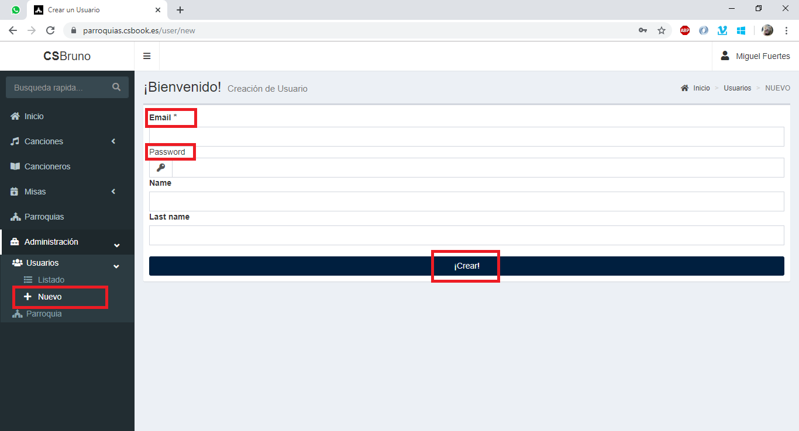

## Administración de usuarios
En esta seccion se describe como crear usuarios para tu parroquia, asi como cambiar los roles de dichos usuarios.

> **Nota**: Recuerda que solo un __*Administrador*__ tiene permisos para ver y editar estas paginas.

### Creación de usuarios
Para crear un usuario nuevo, nos vamos a `Administracion > Usuarios > Nuevo`, rellenamos los datos y clickamos en Guardar. Solo los campos __*email*__ y __*password*__ son obligatorios. El usuario podra cambiar su contraseña y sus datos personales en otra pantalla.

> **Nota**: El usuario creado no tiene ningun role especifico, recordemos que los roles posibles pueden ser, *Editor* o *Administrador*

### Edicion de Roles
De la misma manera que se se pueden usuarios, se pueden asignar roles, para ello nos vamos a `Administracion > Usuarios > Listado` y le buscamos en la lista y le clicamos en el role que queramos utilizar para ese usuario. Se seleccionara y desseleccionara en funcion de si esta activo o no.

