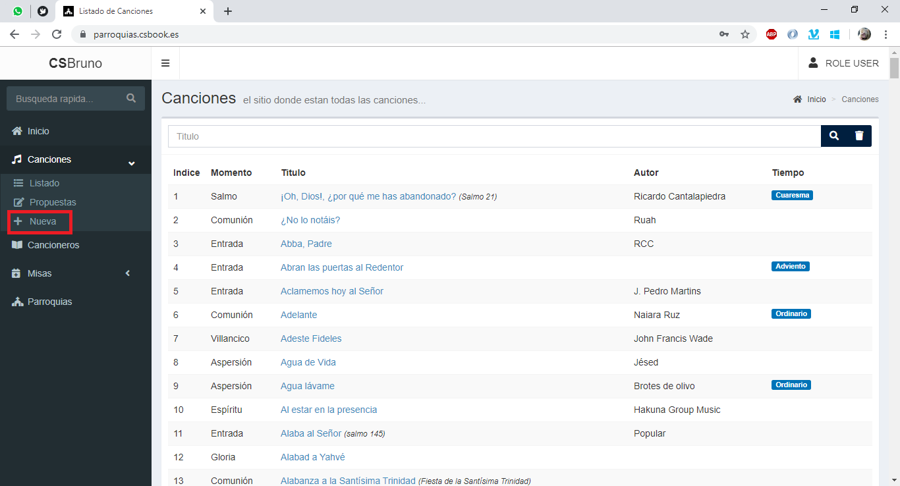
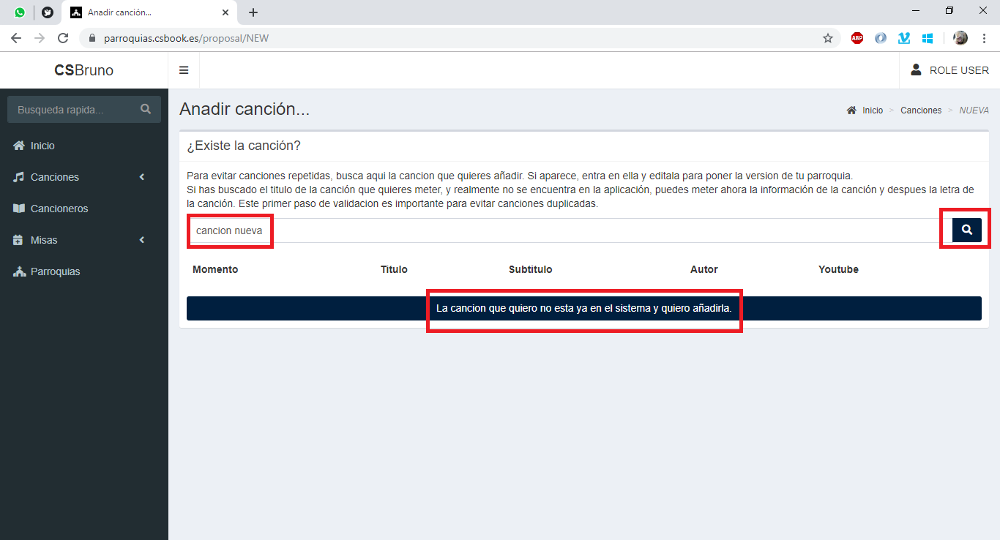
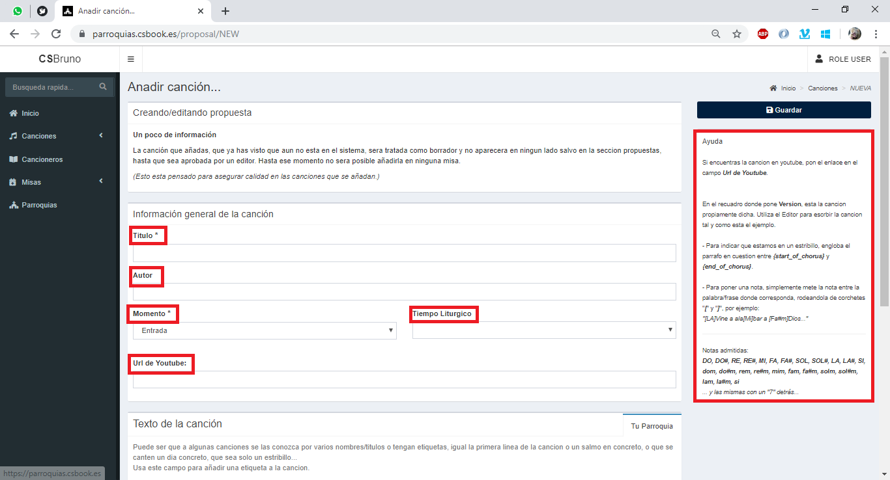
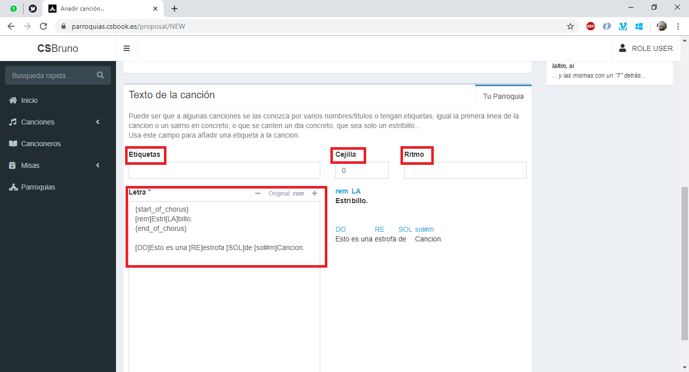
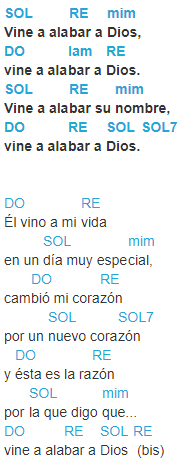

## Gestión de canciones: Usuario
La plataforma admite varios tipos de acceso, usuario, editor y administrador. Estas aqui porque eres administrador y quieres saber que puedes hacer con la plataforma. 

Con tu rol, puedes proponer canciones. Estas canciones no se podran usar para nada hasta que un __*editor*__ la apruebe.

### ¿Cómo propongo una canción?
Para proponer una canción tienes que estar logueado con tu usuario y dirigirte a esta seccion:



La siguiente pantalla es una pantalla de verificación para intentar que no haya canciones repetidas en la plataforma debido a un fallo en la escritura del nombre. Nos pedira que busquemos la cancion que queremos meter. 



Si la canción que queremos meter no esta en la lista, simplemente clicamos el boton azul grande de abajo. Si esta en la lista, tendremos que hablar con un editor para que la edite con su cuenta.

Se nos desplegaran todos los campos de una canción, primero los comunes y luego los especificos de tu version, de tu parroquia.



Campos genericos:
- **Nombre/Titulo***: El titulo de la canción
- **Autor***: El autor de la canción
- **Momento***: El momento dentro de la misa donde comunmente se canta esta cancion. Es simplemente orientativo, no bloquea esta cancion a este momento especifico.
- **Tiempo liturgico**: El tiempo liturgico.
- **Url de Youtube**: La url de youtube para poder aprender la cancion, si es que tiene.



Mas abajo vemos los campos especificos de la version, y por tanto de tu parroquia:
- **Etiquetas**: Es un campo donde poner otros titulos o nombres por los que en tu parroquia conoceis a la canción. (_ej:_ _**"Amaos"**_ tambien se conoce como _**"Como el padre me amó"**_)
- **Cejilla**: La cejilla con que tocais esa cancion en tu parroquia.
- **Ritmo**: El rimpo con el que la tocais. (_ej:_ 4x4)
- **Letra**: Este es el campo mas importante. Por defecto te viene rellando con un ejemplo para que veas como se meten los acordes y los estribillos. 
  > Si metes los acordes de esta manera, el sistema los reconocera y se podra cambiar de tono la canción.
  
  Para meter acordes es tan sencillo como meterlos dentro de la frase entre corchetes. En la columna de ayuda de la derecha, puedes ver los acordes que pueden ser reconocidos. Por ejemplo, para la canción "Vine a alabar a Dios":

  Este codigo:

  ```
    {start_of_chorus}
    [SOL]Vine a ala[RE]bar a [mim]Dios,
    [DO]vine a ala[lam]bar a [RE]Dios.
    [SOL]Vine a ala[RE]bar su [mim]nombre,
    [DO]vine a ala[RE]bar a [SOL]Dios.[SOL7]
    {end_of_chorus}

    [DO]Él vino a mi [RE]vida
    en un [SOL]día muy espe[mim]cial,
    cam[DO]bió mi cora[RE]zón
    por un [SOL]nuevo cora[SOL7]zón
    y [DO]ésta es la ra[RE]zón
    por [SOL]la que digo [mim]que...
    [DO]vine a ala[RE]bar a [SOL]Dios[RE] (bis)
  ```

  Generará esto:

  

  Aunque conforme vayais escribiendo en el cuadro de texto, vereis que se va actualizando.

  Una vez puesta la cancion como quieres, simplemente hay que darle a guardar, en el boton azul, arriba de la pagina.

