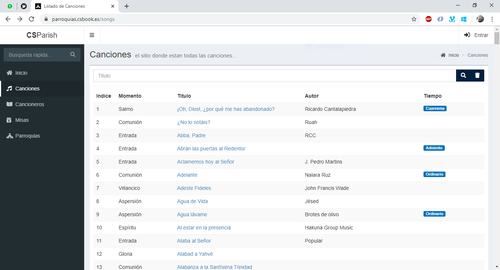

## Gestión de Canciones
La aplicacion permite crear y gestionar canciones. Aqui cabria distinguir dos cosas, las canciones y las versiones. La cancion contiene la información general, _titulo_, _autor_, _momento de la misa_, _tiempo liturgico_ e incluso el _video de youtube_.

Para ver las canciones creadas, simplemente hemos de clicar en el apartado __*Canciones*__.

