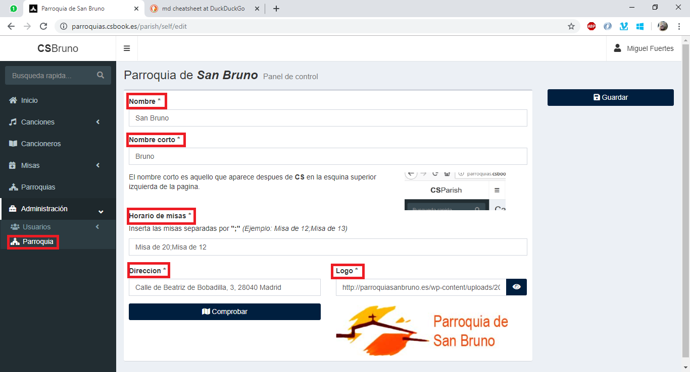
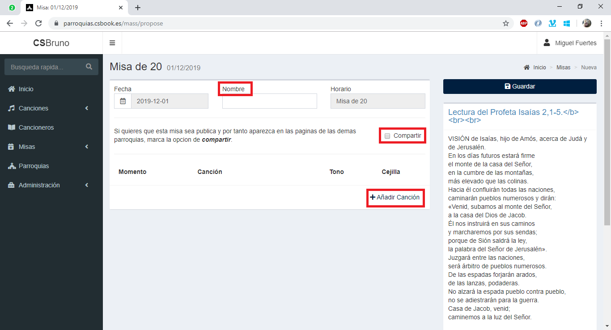
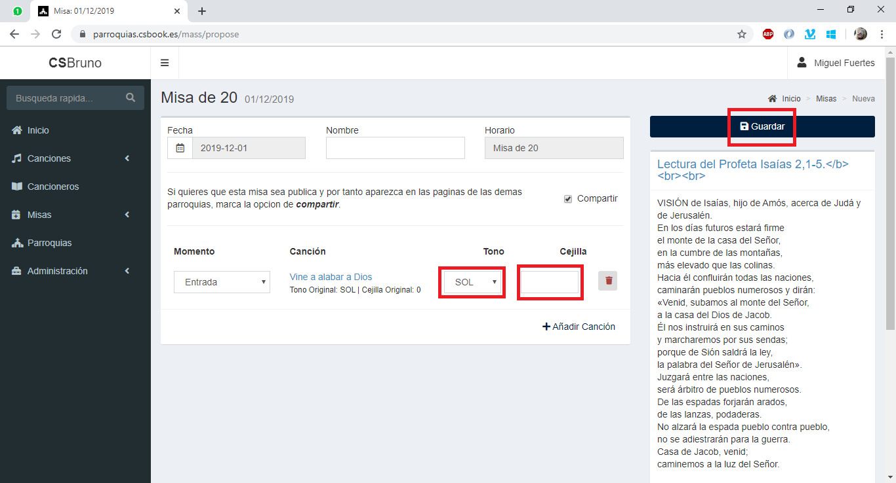

# Cancionero Católico

Es un sistema de gestión de canciones, misas y cancioneros, multiparroquia, con posibilidad de exportación a Word y Powerpoint.

## Primeros Pasos
> **Nota**: Recuerda que solo un __*Administrador*__ puede realizar estos cambios.

Acabo de recibir mi perfil de parroquia, **¿qué es lo primero que tengo que hacer?**:

1. Entrar en la pagina con tu cuenta:
  
2. Ir a la seccion de tu parroquia:
  
3. Rellenar los datos basicos, como son nombre corto, y sobretodo **horarios de misas**. Separa los horarios de misa con ";", tienes un ejemplo justo encima del cuadro de texto.
4. ¡Comenzar a usar la plataforma!

## Primera misa
> **Nota**: Recuerda que solo un __*Editor*__ puede realizar estos cambios. Un __*Usuario*__ podra realizar una propuesta, pero su misa no sera definitiva.

Como ya hemos puesto los horarios de la parroquia, ya podemos crear misas. Para ello haremos lo siguiente:

1. Nos vamos a la seccion de __*Mi Parroquia*__ y rellenamos los campos segun la imagen:
  
2. Al darle al boton nueva, se nos abrira la siguente pantalla:
  
3. Rellenamos lo que necesitemos de la primera linea. Marcamos si queremos que la misa sea publica, y clicamos el boton __*Añadir canción*__ para empezar a meter las canciones.
  
4. En esta pantalla seleccionamos el momento, podemos filtrar usando el recuadro justo debajo, y seleccionamos la cancion que queramos añadir. Cuando lo tengamos, pulsamos el boton verde.
5. En esta pantalla, veremos que la cancion ya se ha añadido. Podemos cambiar el tono para esta misa en concreto (no para la canción). Cuando esten todas las canciones añadidas (repitiendo el paso anterior), le damos a guardar.
  
6. **¡Ya tenemos la misa creada!** Ahora solo tenemos que compartir el enlace. Si hemos clicado la casilla de "Compartir" el enlace lo podra ver todo el mundo, sino, solamente gente que hayamos añadido y este registrada.
  
  > **Nota**: La misa de la imagen no es la misma que hemos creado en el tutorial, es otra que puedes consultar [aqui](https://parroquias.csbook.es/mass/view/2201911170).