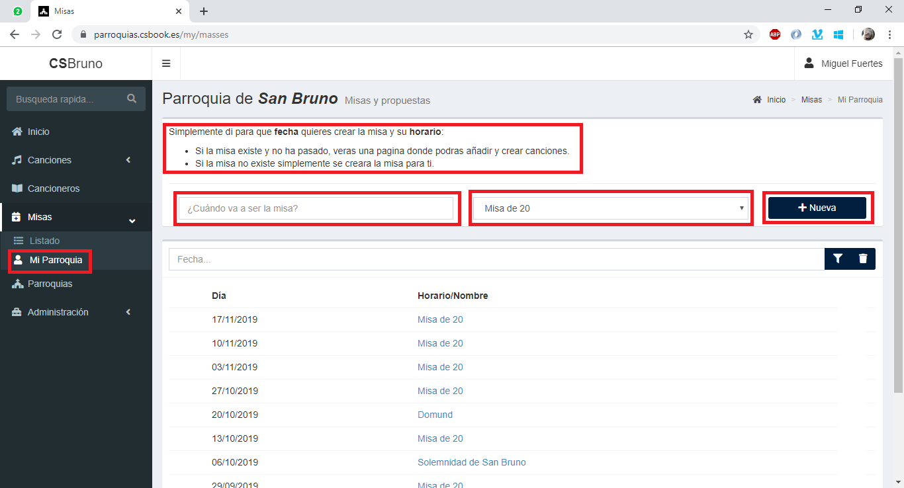

## ¿Cómo crear una misa?
El editor es un usuario con más poderes. Puede aprobar misas, así como crear misas que nadie puede editar. Al editar una misa como editor, la misa ya se marcará como aprobada y nadie (salvo otro editor) podrá editarla.

El proceso es similar al proceso hecho por un usuario. Partimos desde la pagina “Mi Parroquia”. Rellenamos los campos de cuando va a ser la misa y el horario, y pulsamos sobre “Nueva”

Si la misa existe y no ha pasado, o aún no existe y eres el primero, te llevara a la página de edición como esta:

>**Nota**: A partir de aqui, son los mismos pasos que para un [usuario](USUARIO.html) normal (sección: cómo proponer una misa).

## ¿Cómo apruebo una misa?
Hay dos formas de aprobar una misa. La primera es como hemos visto en el apartado anterior, editándola. Al guardarla como editor se aprobará directamente.
La segunda es utilizando el botón en forma de “V” para aprobar.

Tras aprobarse, volverás a la misma pagina, pero veras que el lápiz del inicio de la línea y el “tic” que acabas de pulsar ya no están.