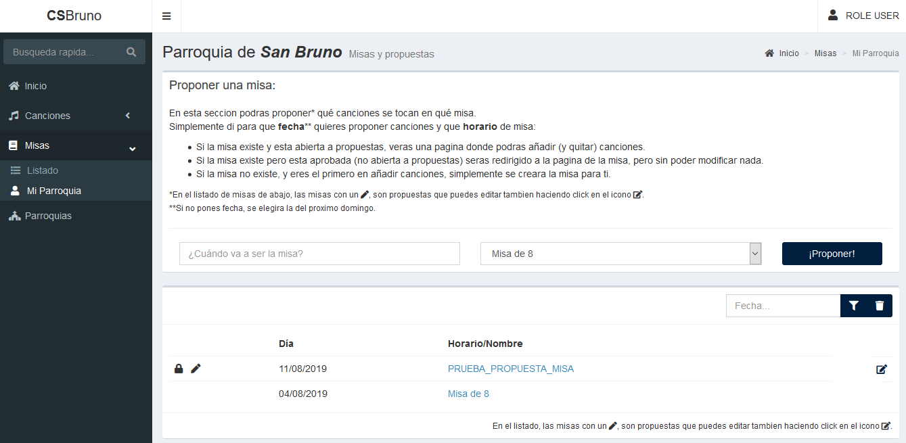
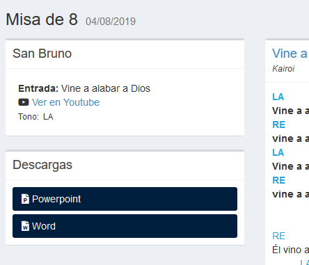
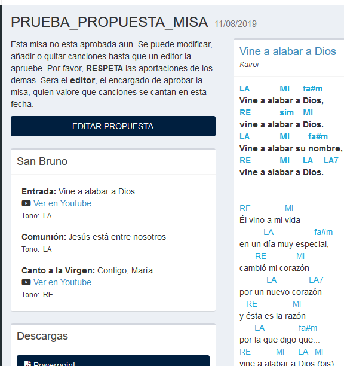
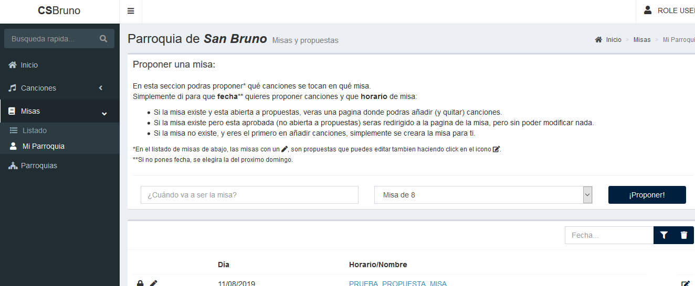
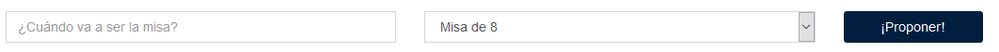
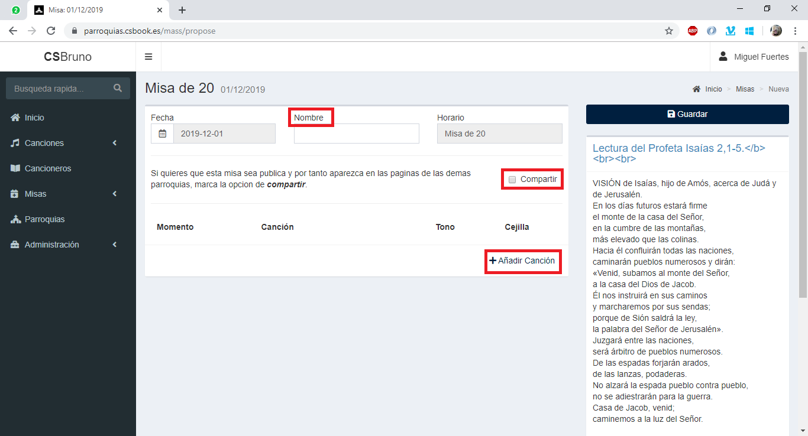
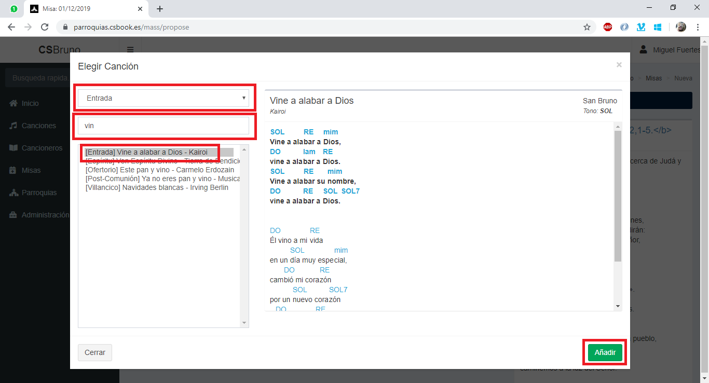
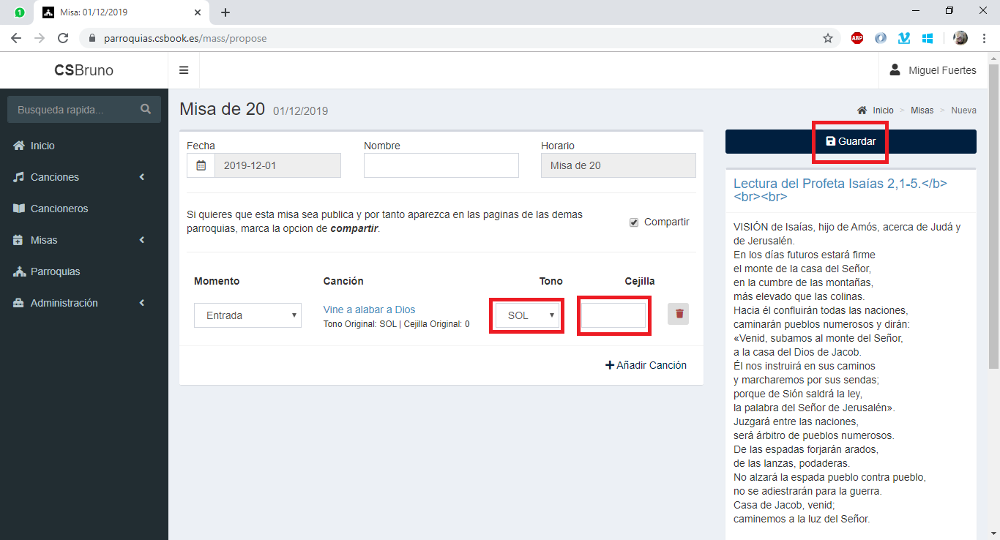

## Gestión de Misas: Usuario
Aqui se detalla como ver las misas de tu parroquia asi como poder proponer una misa.

### ¿Cómo ver las misas de mí parroquia?
Para ver las misas creadas para mi parroquia, debemos ser al menos **usuarios** (tener usuario y contraseña) simplemente debemos dirigirnos a la página _**Mi Parroquia**_.

-	Si la misa esta aun abierta a propuestas, tendrá el icono del lápiz al inicio, así como un icono al final sobre el que podremos pinchar y añadir más canciones.
-	Si la misa es privada (no se compartirá públicamente con todo el que entre en la página) veremos al principio de la line un icono de un candado.

Pinchando en el nombre u horario de una misa entraremos en su pagina de visualización. Si la misa esta abierta a propuestas, veremos un botón para poder editar la propuesta.

|Misa Aprobada| Misa Abierta |
|--- |--- |
|||

### ¿Cómo proponer una misa?
Como usuario también puedes proponer misas. Podrás añadir canciones a las misas ya propuestas hasta que un editor las apruebe.
1.	Dirígete a la página “Mi Parroquia”

2.	Rellena los datos de fecha y horario de misa para la misa que quieres proponer, y haz pincha en proponer:

    - Si la misa existe y esta abierta a propuestas (aun no esta aprobada por el editor), o aun no existe y eres el primero, te llevara a la página de edición como esta:
    
      - El botón añadir canción, desplegara una ventana donde podrás buscar y previsualizar la canción que quieres añadir. Al añadirla se creará una línea nueva, como las que se ven en la imagen.
      
      
      - Una vez hechas las propuestas, el botón “Guardar” guardara los cambios.
    - Si la misa existe y no esta abierta a propuestas, serás redirigido a la página de visualización de la misa. _(ver apartado anterior)_